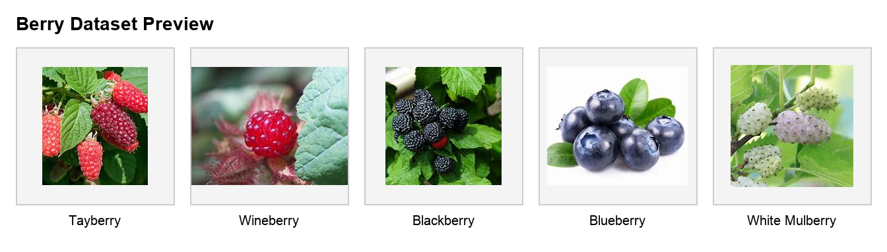
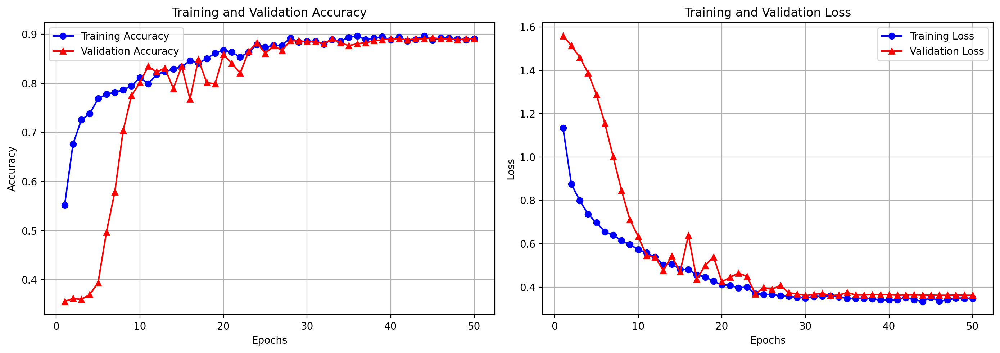
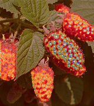

# Berry Classification Using Explainable AI (XAI)

Official repository for berry classification using a multi-branch attention CNN with Grad-CAM, together with the berry image dataset and the main notebook workflow.

**Paper DOI:** [10.1007/978-3-032-07336-5_1](https://doi.org/10.1007/978-3-032-07336-5_1)

## If You Use This Dataset or Code

If you use the **berry dataset**, the **code**, or the **notebook workflow** from this repository, please cite:

1. Bandopadhyay, S., Banerjee, S., and Debnath, N. C. *Explainable Deep Learning in Berry Classification Through Attention Mechanisms and Grad-CAM*. In *The 9th International Conference on Advanced Machine Learning Technologies and Applications (AMLTA'25), Volume 1*, pp. 3-12. Springer, Cham. DOI: [10.1007/978-3-032-07336-5_1](https://doi.org/10.1007/978-3-032-07336-5_1)

2. Related IEEE reference for this project: [IEEE Xplore document 11234039](https://ieeexplore.ieee.org/abstract/document/11234039)

## Overview

This repository contains:

- the main notebook: `PIE_berry_Multi_branch_XAI_.ipynb`
- the berry image dataset
- a script-based training workflow for the paper model
- evaluation and Grad-CAM generation scripts

The primary workflow in this repository is built around `PIE_berry_Multi_branch_XAI_.ipynb`.

## Berry Dataset

The dataset used in this project contains **2,519 berry images** across five classes:

- Tayberry: `500`
- Wineberry: `500`
- Blackberry: `580`
- Blueberry: `615`
- White Mulberry: `324`

Dataset folder structure:

```text
dataset/
├── Tayberry/
├── Wineberry/
├── black berry/
├── blueberry/
└── white mulberry/
```

Full dataset details, class folders, and citation information are available in [dataset/README.md](dataset/README.md).

### Dataset Preview



## Repository Structure

```text
.
├── PIE_berry_Multi_branch_XAI_.ipynb
├── README.md
├── environment.yml
├── requirements.txt
├── dataset/
├── scripts/
│   ├── train.py
│   ├── evaluate.py
│   ├── validate.py
│   ├── gradcam.py
│   └── run_notebook.py
├── src/
│   └── berry_xai/
├── docs/
│   └── images/
└── outputs/
```

## Main Notebook

The main notebook for this project is:

- `PIE_berry_Multi_branch_XAI_.ipynb`

This notebook contains the paper-style workflow for:

- dataset loading
- training the multi-branch attention CNN
- evaluation
- Grad-CAM visualization

## Setup

### Conda

```bash
conda env create -f environment.yml
conda activate berry-xai
```

### venv

```bash
python3 -m venv .venv
source .venv/bin/activate
pip install -r requirements.txt
```

## Quick Start

### 1. Validate the environment

```bash
python scripts/validate.py --dataset-root dataset
```

### 2. Train the paper model

```bash
python scripts/train.py \
  --dataset-root dataset \
  --model proposed \
  --output-dir outputs/paper_proposed
```

### 3. Evaluate the results

```bash
python scripts/evaluate.py \
  --run-dir outputs/paper_proposed
```

### 4. Generate Grad-CAM

```bash
python scripts/gradcam.py \
  --model-path outputs/paper_proposed/best_model.h5 \
  --image-path dataset/Tayberry/1.jpg \
  --output-path outputs/paper_proposed/gradcam_tayberry_1.png
```

## Example Results

Example visual outputs from the trained workflow are shown below.

### Training Curves



### Grad-CAM Visualization

| Original | Grad-CAM: Tayberry |
| --- | --- |
|  |  |

*Grad-CAM visualization highlighting the berry regions that contribute most strongly to the model prediction.*

## Outputs

Running the training workflow creates artifacts under `outputs/paper_proposed/`, including:

- trained model
- metrics
- classification report
- training curves
- prediction CSV
- Grad-CAM image

For the public repository, lightweight example figures are also included under `docs/images/`.

## Scripts

- `scripts/train.py`: main training script for the paper-aligned model
- `scripts/evaluate.py`: compares run metrics against the paper values
- `scripts/validate.py`: checks environment and dataset visibility
- `scripts/gradcam.py`: generates Grad-CAM from a trained model
- `scripts/run_notebook.py`: auxiliary script version of an older workflow, not the main paper path

## GPU Server Usage

If you are running on a GPU server:

```bash
cd /path/to/Pie_Berry
conda env create -n berry-xai-gpu -f environment.yml
conda activate berry-xai-gpu
python -m pip install -r requirements.txt

python scripts/validate.py --dataset-root dataset

CUDA_VISIBLE_DEVICES=1 python scripts/train.py \
  --dataset-root dataset \
  --model proposed \
  --output-dir outputs/paper_proposed

python scripts/evaluate.py \
  --run-dir outputs/paper_proposed

python scripts/gradcam.py \
  --model-path outputs/paper_proposed/best_model.h5 \
  --image-path dataset/Tayberry/1.jpg \
  --output-path outputs/paper_proposed/gradcam_tayberry_1.png
```

## Notes

- The main paper workflow uses the notebook-style validation split configuration.
- `scripts/train.py` is the main command-line version of the notebook workflow.
- `run_notebook.py` is not required for the main paper results.

## References

- Springer chapter: [10.1007/978-3-032-07336-5_1](https://doi.org/10.1007/978-3-032-07336-5_1)
- IEEE reference: [https://ieeexplore.ieee.org/abstract/document/11234039](https://ieeexplore.ieee.org/abstract/document/11234039)
